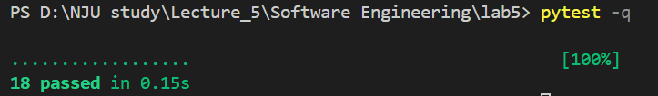
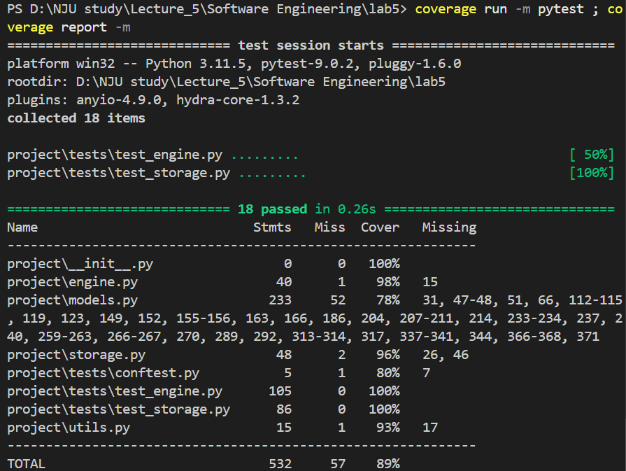
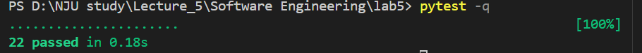
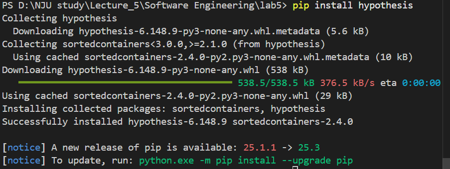
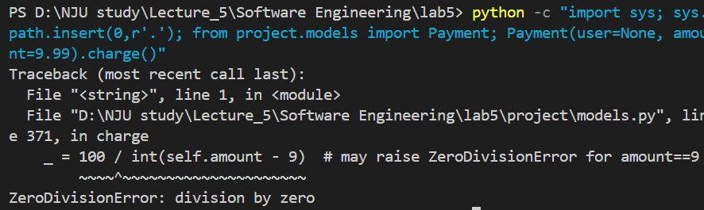

231870210 沈奕齐 

环境：WIN11，python3.11.5
[TOC]
# Lab5 实验报告
## 单元测试报告 

**测试目的**
- 验证两个子功能的正确性与稳定性：
  1. **RecommendationEngine**（推荐引擎）：打分规则、边界条件、top-k 返回正确性。
  2. **InMemoryD    B**（内存仓库）：用户增删查、滑动 (swipe)->互相 like 导致 Match、会话/通知/支付/订阅的存储行为。

**测试环境与工具**
- 操作系统：Windows
- Python：3.11.5
- 测试框架：pytest（命令：`pytest -q`）
- 覆盖率工具：coverage.py（命令：`coverage run -m pytest`，`coverage report -m`）
- 测试文件：`project/tests/test_engine.py`、`project/tests/test_storage.py`

**运行摘要**
- 测试总数：18（全部通过） 
- 覆盖率（语句/行覆盖）：
  - `project/engine.py`：**98%**
  - `project/storage.py`：**96%**
  - `project/models.py`：**78%**（模型模块依赖较多，尚有未覆盖的 helper 与 to_dict 等方法）
  - `project/utils.py`：**93%**
  - **总体覆盖率**：**89%**（满足总体 > 80% 要求）

---

**测试用例详情（单元级）**

### A. RecommendationEngine（共 10 条）
- test_score_missing_profile_returns_negative
  - 目的：若任一用户缺少 profile，应返回 -1.0
  - 预期：`-1.0`；实际：`-1.0`（通过）
- test_gender_match_higher_than_mismatch
  - 目的：性别偏好匹配的候选人得分高于不匹配者
  - 预期：匹配分数 > 不匹配分数；实际：成立（通过）
- test_age_within_range_vs_outside
  - 目的：年龄在偏好范围内得分高于不在范围的（两端）候选者
  - 预期：内部 > 外部；实际：成立（通过）
- test_shared_interests_increase
  - 目的：共同兴趣提高得分
  - 预期：shared > none；实际：成立（通过）
- test_profile_completeness_increases_score
  - 目的：资料完整度应提高分数
  - 预期：complete > incomplete；实际：成立（通过）
- test_distance_penalty_and_bonus
  - 目的：距离近带来加分，超过 max_distance 会被惩罚
  - 预期：near > far；实际：成立（通过）
- test_compute_matches_returns_top_k
  - 目的：返回 `top_k` 个候选并按得分排序
  - 预期：长度 = k，且排序正确；实际：成立（通过）
- test_random_tiebreaker_effect
  - 目的：验证随机因子影响分数（用于平局打破）
  - 预期：随机更大时分数不会更小；实际：成立（通过）
- test_score_is_finite
  - 目的：分数为有限 float（非 NaN）
  - 预期：float 且非 NaN；实际：成立（通过）
- test_compute_matches_excludes_self_and_ordering
  - 目的：compute_matches 排除自身并保持排序
  - 预期：不包含自身且头部为最优候选；实际：成立（通过）

> 覆盖：`project/engine.py` 达到 **98%**（语句覆盖）

### B. InMemoryDB（共 10 条）
- test_add_user_and_find_by_email
  - 目的：添加用户并通过 email（不区分大小写）查找
  - 预期：能找到用户；实际：成立（通过）
- test_add_swipe_creates_match_on_mutual_like
  - 目的：互相 `like` 产生 Match
  - 预期：返回 Match 且存入 db.matches；实际：成立（通过）
- test_add_swipe_no_match_on_pass
  - 目的：`pass` + `like` 不应产生 match
  - 预期：无 match；实际：成立（通过）
- test_no_duplicate_match_creation
  - 目的：重复 mutual like 不创建多个 match
  - 预期：match 唯一；实际：成立（通过）
- test_add_conversation_stores_conv
  - 目的：会话数据被保存
  - 预期：conv id 在 db.conversations；实际：成立（通过）
- test_add_notification_stores
  - 目的：通知存储
  - 预期：notification id 在 db.notifications；实际：成立（通过）
- test_add_report_stores
  - 目的：举报存储
  - 预期：report id 在 db.reports；实际：成立（通过）
- test_add_subscription_and_payment_stores
  - 目的：支付与订阅记录被保存
  - 预期：相应 id 被记录；实际：成立（通过）
- test_find_user_by_email_case_insensitive
  - 目的：验证 email 查找不区分大小写
  - 预期：可找到用户；实际：成立（通过）
- test_find_user_returns_none_when_missing
  - 目的：缺失用户返回 None
  - 预期：返回 None；实际：成立（通过）

> 覆盖：`project/storage.py` 达到 **96%**（语句覆盖）

- 覆盖率类型：**语句/行覆盖（Line coverage）**，由 `coverage.py` 计算。
- 总体：**89%**（已满足 >80% 要求）。
- 发现：`project/models.py` 覆盖为 **78%**，较低。未覆盖的主要是：
  - 各类 `to_dict()` 序列化路径和字段断言
  - `Photo.upload()/delete()` 状态变更分支
  - `Subscription.is_active()` 在不同 `tier` 与 `expires_at` 边界的分支
  - `Message.edit()/mark_read()`（时间戳变更）和 `Conversation.send_message()` 的异常路径（sender 不在 participants）


```bash
# 运行测试
pytest -q

# 生成覆盖率报告（如果安装 coverage）
coverage run -m pytest
coverage report -m
```

测试结果图片与覆盖率截图：






## 集成测试报告 


### 一、总体信息
- **测试策略**：自顶向下（Top-down）——从业务流程出发验证模块组合后的系统级行为。
- **测试文件**：`project/tests/test_integration.py`（包含两组集成用例）。
- **测试数量**：2 组集成测试（与已有单元测试合并后总用例数为 22）。
- **执行命令与结果**：`pytest -q` → **22 passed**（全部通过）。
截图：


### 二、测试环境与工具
- 测试框架：pytest（使用 `monkeypatch` 控制随机性以保证确定性）
- 运行环境：本地内存实现的 `InMemoryDB`（不依赖外部服务），便于端到端验证模块交互

### 三、测试方法（总体）
- 采用自顶向下的方法，在真实的 `InMemoryDB` 上搭建测试数据（用户、偏好），调用高层接口（`RecommendationEngine.compute_matches`、滑动/匹配/会话/支付/通知等），通过断言验证端到端流程结果。
- 使用确定性控制（如对 `random.random()` 打桩）以消除非确定性因素对结果的影响。

### 四、逐用例说明

A）推荐引擎端到端（`test_recommendation_end_to_end_excludes_self_and_returns_best`）
- 测试目的：验证在真实 DB 中，推荐引擎正确筛选候选、排除自身、并返回按得分排序的 top_k。
- 测试对象：`RecommendationEngine.compute_matches` 与 `InMemoryDB` 中的用户数据集合。
- 测试方法：在 DB 中创建若干用户、为“我”配置兴趣偏好（如 `hiking`），设置某候选为明显更匹配（`hiking, coffee`），调用 `compute_matches(me, candidates, top_k=3)`。
- 预期输出：返回长度为 3 的候选列表，不包含“我”，首位为共享兴趣最多的用户。
- 实际输出：符合预期（返回 top3，首位为该候选，且所有结果均来自 DB）。
- 分析：该用例验证了推荐与数据层的集成与排序逻辑；建议增加空候选集与大量候选量级下的性能与稳定性测试。

B）社交流程端到端（`test_social_flow_end_to_end_swipe_match_conversation_payment_notification`）
- 测试目的：验证滑动互赞能形成 Match、随之创建 Conversation 并发送消息、支付成功后记录 Subscription 与 Notification 的完整业务链。
- 测试对象：`InMemoryDB`、`Swipe`/`Match` 流程、`Conversation`、`Payment`、`Subscription`、`Notification`。
- 测试方法：创建 Alice 与 Bob；Alice like Bob；Bob like Alice -> 断言生成 Match 并存入 DB；创建会话并发送消息（断言消息数量与存储）；模拟支付成功（通过打桩随机数），验证 subscription 与 notification 被记录。并测试异常：非参与者发送消息应抛出 `ValueError`。
- 预期输出：Match 存在于 DB，Conversation 存在且消息被添加，非参与者发送消息抛错，支付成功后 Subscription 与 Notification 被记录。
- 实际输出：符合预期（全部断言通过，支付成功通过 monkeypatch 控制）。
- 分析：该用例覆盖了社交流程的主通路和一处异常路径（消息发送者非参与者）；建议新增支付失败路径、Subscription 过期/续费边界测试，以及并发滑动导致竞态的测试。

## 模糊测试报告 

### 工具选取与安装
- 选取理由：使用 Hypothesis（Python 的 property-based testing 库），适合自动生成大量边界和随机输入并能缩小反例（counterexample）。
- 安装命令（在项目根目录运行）：
  - pip install hypothesis`
- 截图：


### 使用说明
- 测试文件：`project/tests/test_fuzz.py`（包含 Hypothesis 测试 `test_payment_charge_no_crash` 与 `test_payment_charge_small_range_finds_bug`）。
- 运行命令：
  - `pytest -q project/tests/test_fuzz.py | tee fuzz_run.log`
  - 截图：
  - 
- Hypothesis 说明：
  - 使用 `@given(...)` 装饰器声明输入策略（如 `st.floats(...)`），Hypothesis 会尝试多组输入并在失败时给出可复现且最小化的反例供调试。

### 3 发现的崩溃用例与复现步骤
- 问题描述（人为注入）：在 `project/models.py` 的 `Payment.charge()` 中插入了危险算术：
  - `_ = 100 / int(self.amount - 9)`，当 `amount` 在 [9.0, 10.0)（例如 9.0 或 9.99）时，可能触发 `ZeroDivisionError`。
- 自动发现：在运行测试时（集成测试或 Hypothesis），对此情形触发了 `ZeroDivisionError`（pytest 输出包含 traceback）。
- 复现命令：
  - `python -c "import sys; sys.path.insert(0,r'.'); from project.models import Payment; Payment(user=None, amount=9.99).charge()"`
  

## 持续集成 (CI) 报告


## 程序修复报告
